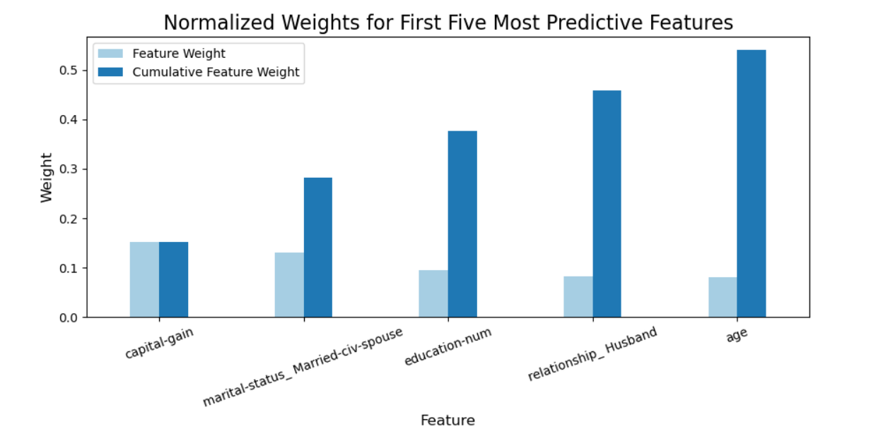

# Supervised Learning
## Finding Donors for CharityML

## Project Overview
In this project, I employed several supervised algorithms to accurately model individuals' income using data collected from the 1994 U.S. Census. The goal was to build a binary classification model that predicts whether an individual earns more than $50,000. This sort of task can arise in a non-profit setting, where organizations wish to determine the highest donation probablity from their donor base.

### Install

This project requires **Python 3.x** and the following Python libraries installed:

- [NumPy](http://www.numpy.org/)
- [Pandas](http://pandas.pydata.org)
- [matplotlib](http://matplotlib.org/)
- [scikit-learn](http://scikit-learn.org/stable/)

### Data

The modified census dataset consists of approximately 32,000 data points, with each datapoint having 13 features. This dataset is a modified version of the dataset published in the paper *"Scaling Up the Accuracy of Naive-Bayes Classifiers: a Decision-Tree Hybrid",* by Ron Kohavi. The original dataset hosted on [UCI](https://archive.ics.uci.edu/ml/datasets/Census+Income).

**Features**
- `age`: Age
- `workclass`: Working Class (Private, Self-emp-not-inc, Self-emp-inc, Federal-gov, Local-gov, State-gov, Without-pay, Never-worked)
- `education_level`: Level of Education (Bachelors, Some-college, 11th, HS-grad, Prof-school, Assoc-acdm, Assoc-voc, 9th, 7th-8th, 12th, Masters, 1st-4th, 10th, Doctorate, 5th-6th, Preschool)
- `education-num`: Number of educational years completed
- `marital-status`: Marital status (Married-civ-spouse, Divorced, Never-married, Separated, Widowed, Married-spouse-absent, Married-AF-spouse)
- `occupation`: Work Occupation (Tech-support, Craft-repair, Other-service, Sales, Exec-managerial, Prof-specialty, Handlers-cleaners, Machine-op-inspct, Adm-clerical, Farming-fishing, Transport-moving, Priv-house-serv, Protective-serv, Armed-Forces)
- `relationship`: Relationship Status (Wife, Own-child, Husband, Not-in-family, Other-relative, Unmarried)
- `race`: Race (White, Asian-Pac-Islander, Amer-Indian-Eskimo, Other, Black)
- `sex`: Sex (Female, Male)
- `capital-gain`: Monetary Capital Gains
- `capital-loss`: Monetary Capital Losses
- `hours-per-week`: Average Hours Per Week Worked
- `native-country`: Native Country (United-States, Cambodia, England, Puerto-Rico, Canada, Germany, Outlying-US(Guam-USVI-etc), India, Japan, Greece, South, China, Cuba, Iran, Honduras, Philippines, Italy, Poland, Jamaica, Vietnam, Mexico, Portugal, Ireland, France, Dominican-Republic, Laos, Ecuador, Taiwan, Haiti, Columbia, Hungary, Guatemala, Nicaragua, Scotland, Thailand, Yugoslavia, El-Salvador, Trinadad&Tobago, Peru, Hong, Holand-Netherlands)

- **Target:** `income` (>50K or <=50K).

## Methodology
1. **Data Preprocessing:** - Log-transformation for skewed features (`capital-gain`, `capital-loss`).
   - Min-Max Scaling for numerical features.
   - One-hot encoding for categorical variables.
2. **Model Evaluation:** - Tested **Gaussian Naive Bayes**, **Random Forest**, and **K-Neighbors Classifier**.
   - Evaluated based on Accuracy and F-Score (Beta=0.5) to prioritize precision.
3. **Optimization:**
   - Selected **Random Forest Classifier** as the best candidate.
   - Tuned hyperparameters (`n_estimators`, `max_depth`, `min_samples_split`) using `GridSearchCV`.

## Results
The optimized Random Forest model achieved the following performance on the testing set:
- **Accuracy:** ~86%
- **F-Score:** ~0.73

### Top 5 Predictive Features
Using the `feature_importances_` attribute of the Random Forest model, the following features were identified as the most influential in predicting an individual's income level:

1. **Capital Gain:** Financial investments are a strong indicator of wealth.
2. **Marital Status (Married-civ-spouse):** Household stability often correlates with higher combined income.
3. **Education Number:** Higher education levels generally lead to better-paying jobs.
4. **Relationship (Husband):** Correlates with the marital status factor.
5. **Age:** Experience and seniority in careers typically increase with age.
